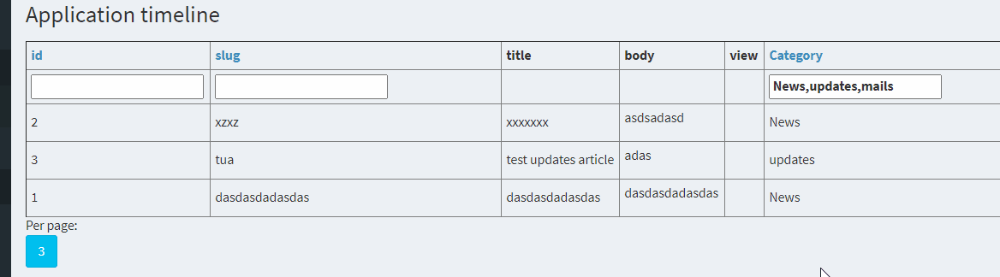

# datatables
generic framework-agnostic composer installable data-tables

After installing this library via ``` composer install fantomx1/datatables  ```,
install the library's assets as follows (it utilizes package fantomx1/packages-assets-support for the operation) 

### Installing this library's assets
execute this command
```
cd vendor/fantomx1/datatables && php ../../../vendor/fantomx1/packagesAssetsSupport/initAssets.php -w=../../../backend/web -o=assets
```
where the **-w option** stands for the relative path to the documentRoot/webDir directory, where to position the assets
(Note: later can be added functionality of the command asking interactively for the documentRoot location, plus hooking up
on composer post-install
)

## Example:



## Usage:
(with columnsDefinitions builder) - really nothing else anymore, and the table is fully functional sortable, filterable

```

        $articleTableWidget = new DataTableWidget();

        // will be needed also at column
        $articleTableWidget->_assoc_ini->setIni(
            $articleTableWidget->_assoc_ini::INI_QUERY_EXECUTOR,
            YiiQueryExecutorPlugin::class
        );

        $articleTableWidget->init();

        $articleTableWidget->setQuery("
            SELECT
                a.*
                ac.title as category_id,
            FROM article a
            JOIN article_category ac ON a.category_id = ac.id  
        ");

        $articleTableWidget->setColumnsDefinition(
                $articleTableWidget->column('category_id')
                    ->setFilter()
                        ->setTypeSelect()
                        ->setDataQuery(
                            "article_category",
                            "id",
                            "title"
                        )->getFilter()
                    ->setCaption('Category')
                    ->setOrderable()
            ],
            [
                $articleTableWidget->column('slug')
                    ->setFilter()
                        ->setTypeSelect()
                        ->setData(
                            [
                                '1'=>'aaa',
                                '2'=>'bbb',
                                '3'=>'ccc'
                            ]
                        )->getFilter()
                    //->setCaption('aaa')
                    ->setOrderable()
            ,
                $articleTableWidget->column('id')
                    ->setFilter()
                        ->setTypeText()
//                        ->setData(
//                            [
//                                '1'=>'aaa',
//                                '2'=>'bbb',
//                                '3'=>'cccc'
//                            ])
                        ->getFilter()
                    //->setCaption('bbb')
                    ->setOrderable()
            ,
                $articleTableWidget->column('category_id')
                    ->setFilter()
                        ->setTypeSelect()
                        ->setDataQuery(
                            "article_category",
                            "id",
                            "title"
                        )->getFilter()
                    ->setCaption('Category')
                    ->setOrderable()
            ]
        );

        // perhaps passed to some view
        $articleTableWidget->run();

```


<b>Roadmap:</b>
https://trello.com/b/7wwQRgNq/fantomx1-datatablesbacklog
